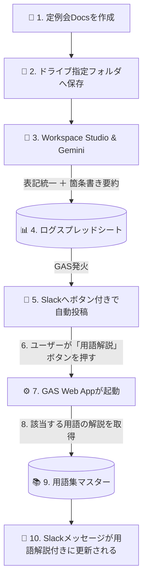

```mermaid
flowchart TD
    %% --- 前半：自動でSlackに届くまで ---
    A[📄 1. 定例会Docsを作成] --> B[📁 2. ドライブ指定フォルダへ保存]
    B --> C[🤖 3. Workspace Studio & Gemini]
    C -->|表記統一 ＋ 箇条書き要約| D[(📊 4. ログスプレッドシート)]
    D -->|GAS発火| E[💬 5. Slackへボタン付きで自動投稿]

    %% --- 後半：ボタンを押した時 ---
    E -->|6. ユーザーが「用語解説」ボタンを押す| F[⚙️ 7. GAS Web Appが起動]
    F -->|8. 該当する用語の解説を取得| G[(📚 9. 用語集マスター)]
    G --> H[📝 10. Slackメッセージが用語解説付きに更新される]
```
