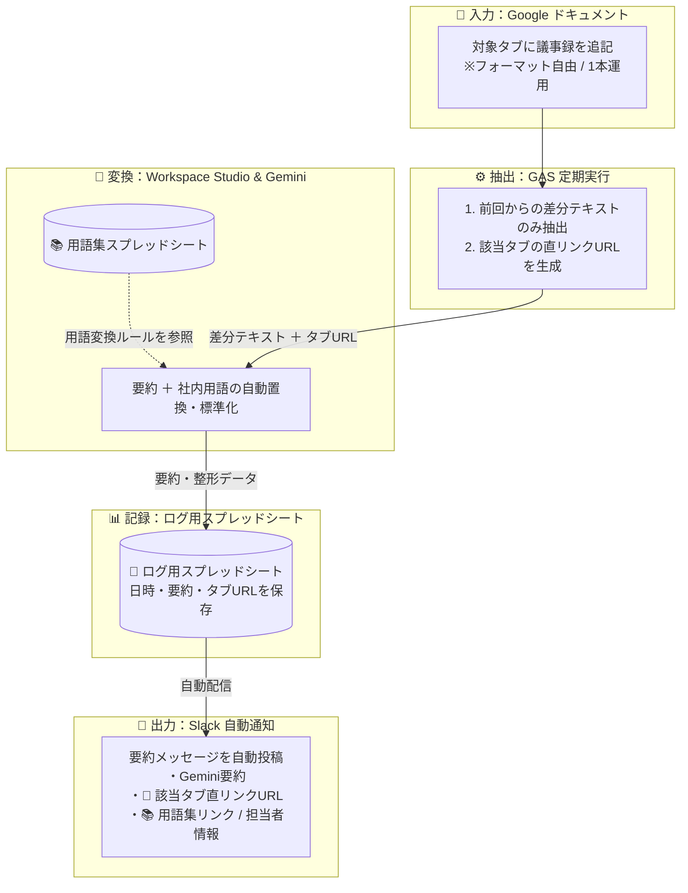

```mermaid
flowchart TD
    %% 1. 入力
    subgraph Step1 [📄 入力：Google ドキュメント]
        A[対象タブに議事録を追記<br>※フォーマット自由 / 1本運用]
    end

    %% 2. 差分＆URL抽出
    subgraph Step2 [⚙️ 抽出：GAS 定期実行]
        B[1. 前回からの差分テキストのみ抽出<br>2. 該当タブの直リンクURLを生成]
    end

    %% 3. AI要約＆用語置換
    subgraph Step3 [🤖 変換：Workspace Studio & Gemini]
        C[要約 ＋ 社内用語の自動置換・標準化]
        D[(📚 用語集スプレッドシート)]
        D -.->|用語変換ルールを参照| C
    end

    %% 4. ログ保存
    subgraph Step4 [📊 記録：ログ用スプレッドシート]
        E[(📝 ログ用スプレッドシート<br>日時・要約・タブURLを保存)]
    end

    %% 5. Slack通知
    subgraph Step5 [💬 出力：Slack 自動通知]
        F[要約メッセージを自動投稿<br>・Gemini要約<br>・📄 該当タブ直リンクURL<br>・📚 用語集リンク / 担当者情報]
    end

    %% データフロー（上から下へ一方通行）
    A --> B
    B -->|差分テキスト ＋ タブURL| C
    C -->|要約・整形データ| E
    E -->|自動配信| F
```
