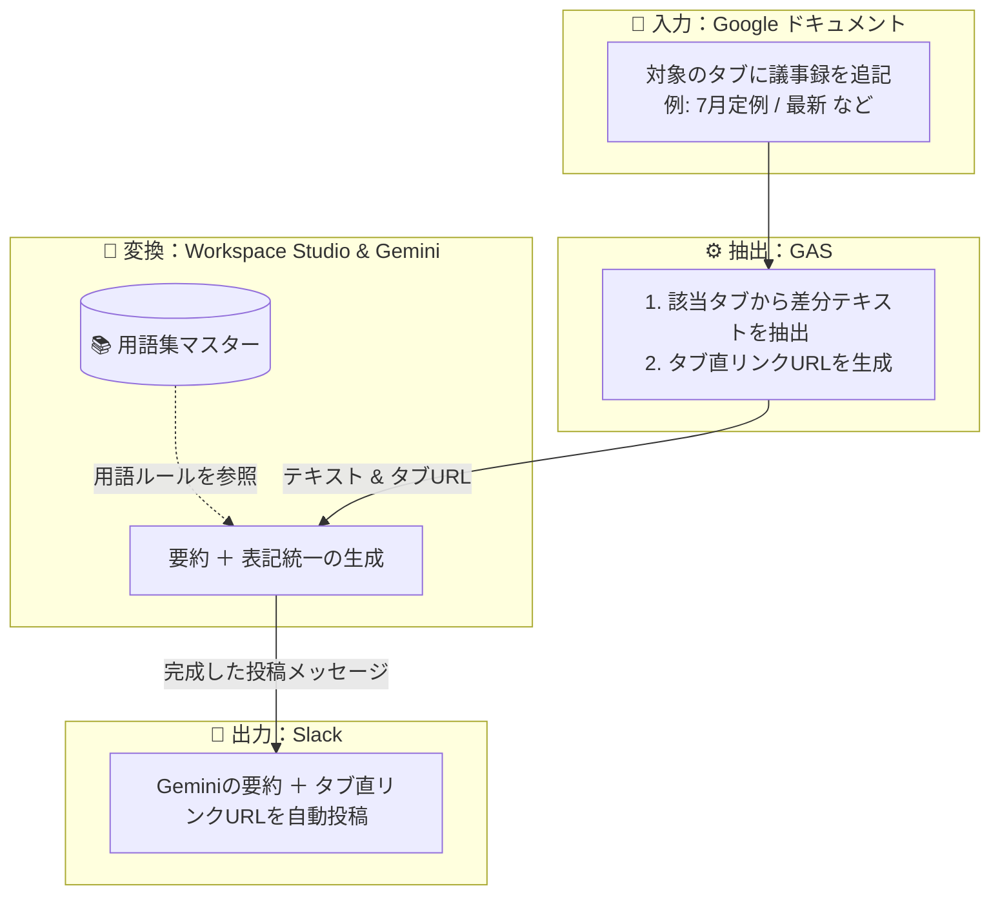

```mermaid
flowchart TD
    %% 1. 入力層
    subgraph Layer1 [📄 入力：Google ドキュメント]
        A[対象のタブに議事録を追記<br>例: 7月定例 / 最新 など]
    end

    %% 2. 抽出処理層
    subgraph Layer2 [⚙️ 抽出：GAS]
        B[1. 該当タブから差分テキストを抽出<br>2. タブ直リンクURLを生成]
    end

    %% 3. AI要約層
    subgraph Layer3 [🤖 変換：Workspace Studio & Gemini]
        C[要約 ＋ 表記統一の生成]
        D[(📚 用語集マスター)]
        D -.->|用語ルールを参照| C
    end

    %% 4. 出力層
    subgraph Layer4 [💬 出力：Slack]
        E[Geminiの要約 ＋ タブ直リンクURLを自動投稿]
    end

    %% データフロー（上から下へのスムーズな流れ）
    A --> B
    B -->|テキスト & タブURL| C
    C -->|完成した投稿メッセージ| E
```
