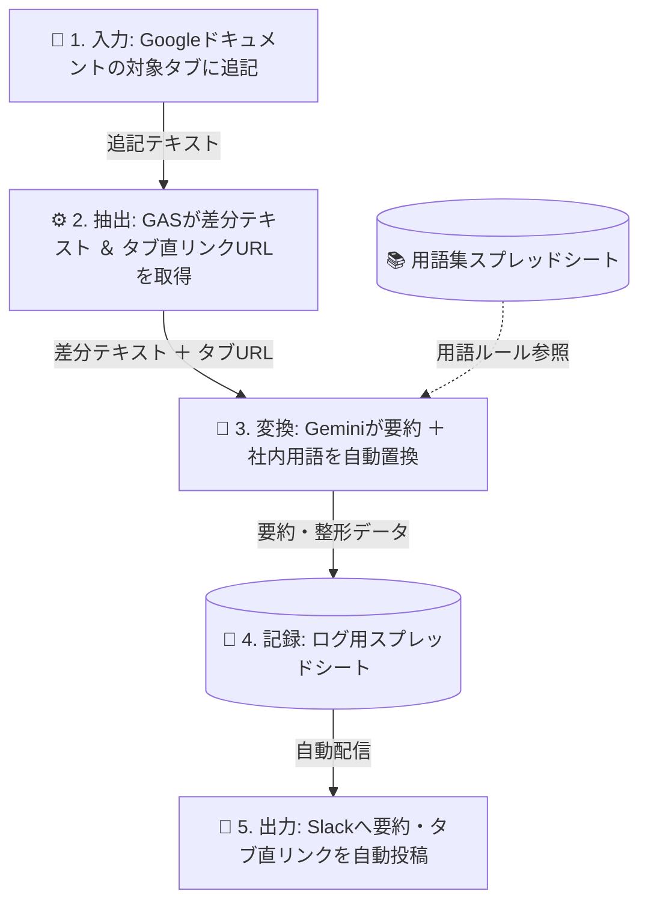

```mermaid
flowchart TD
    A[📄 1. 入力: Googleドキュメントの対象タブに追記] -->|追記テキスト| B[⚙️ 2. 抽出: GASが差分テキスト ＆ タブ直リンクURLを取得]
    B -->|差分テキスト ＋ タブURL| C[🤖 3. 変換: Geminiが要約 ＋ 社内用語を自動置換]
    
    D[(📚 用語集スプレッドシート)] -.->|用語ルール参照| C
    
    C -->|要約・整形データ| E[(📝 4. 記録: ログ用スプレッドシート)]
    E -->|自動配信| F[💬 5. 出力: Slackへ要約・タブ直リンクを自動投稿]
```
