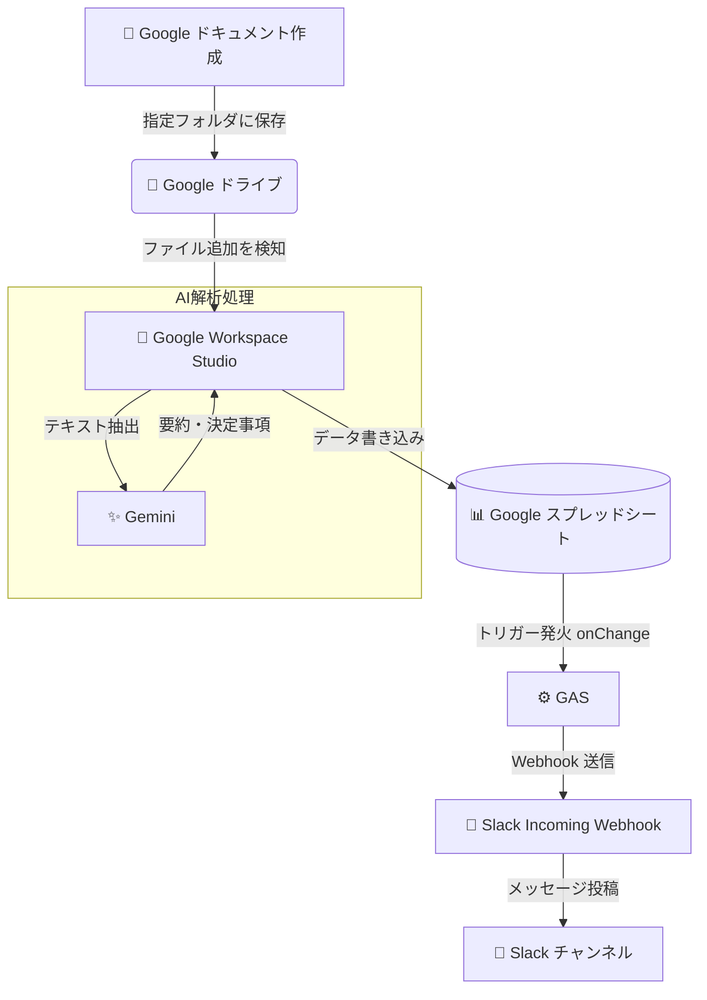

```mermaid
flowchart TD
    A[📄 Google ドキュメント作成] -->|指定フォルダに保存| B(📁 Google ドライブ)
    B -->|ファイル追加を検知| C[🤖 Google Workspace Studio]
    
    subgraph AI解析処理
        C -->|テキスト抽出| D[✨ Gemini]
        D -->|要約・決定事項| C
    end

    C -->|データ書き込み| E[(📊 Google スプレッドシート)]
    E -->|トリガー発火 onChange| F[⚙️ GAS]
    F -->|Webhook 送信| G[🔗 Slack Incoming Webhook]
    G -->|メッセージ投稿| H[💬 Slack チャンネル]
```
