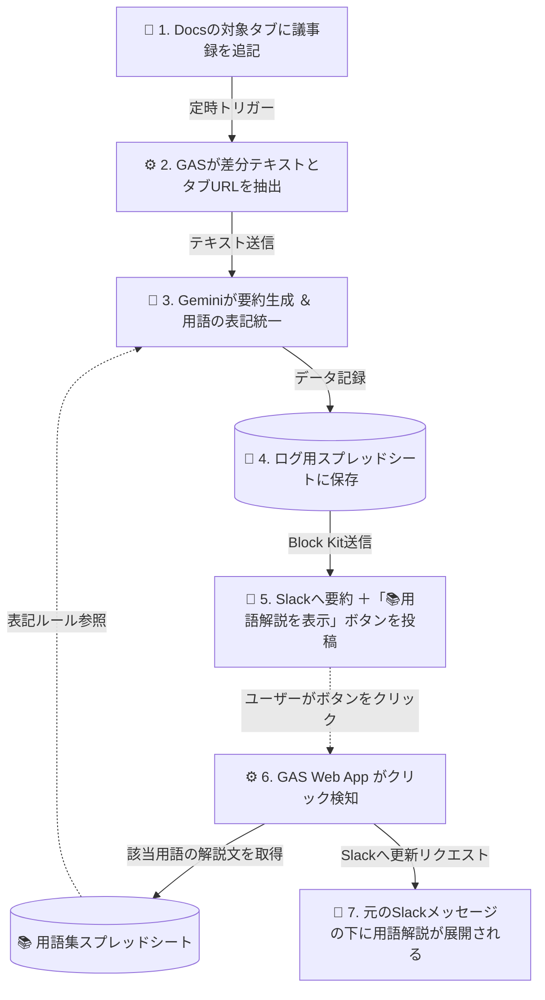

```mermaid
flowchart TD
    %% --- 自動配信フロー ---
    A[📄 1. Docsの対象タブに議事録を追記] -->|定時トリガー| B[⚙️ 2. GASが差分テキストとタブURLを抽出]
    B -->|テキスト送信| C[🤖 3. Geminiが要約生成 ＆ 用語の表記統一]
    D[(📚 用語集スプレッドシート)] -.->|表記ルール参照| C
    C -->|データ記録| E[(📝 4. ログ用スプレッドシートに保存)]
    E -->|Block Kit送信| F[💬 5. Slackへ要約 ＋「📚用語解説を表示」ボタンを投稿]

    %% --- ボタンクリック時のインタラクティブフロー ---
    F -.->|ユーザーがボタンをクリック| G[⚙️ 6. GAS Web App がクリック検知]
    G -->|該当用語の解説文を取得| D
    G -->|Slackへ更新リクエスト| H[💬 7. 元のSlackメッセージの下に用語解説が展開される]
```
