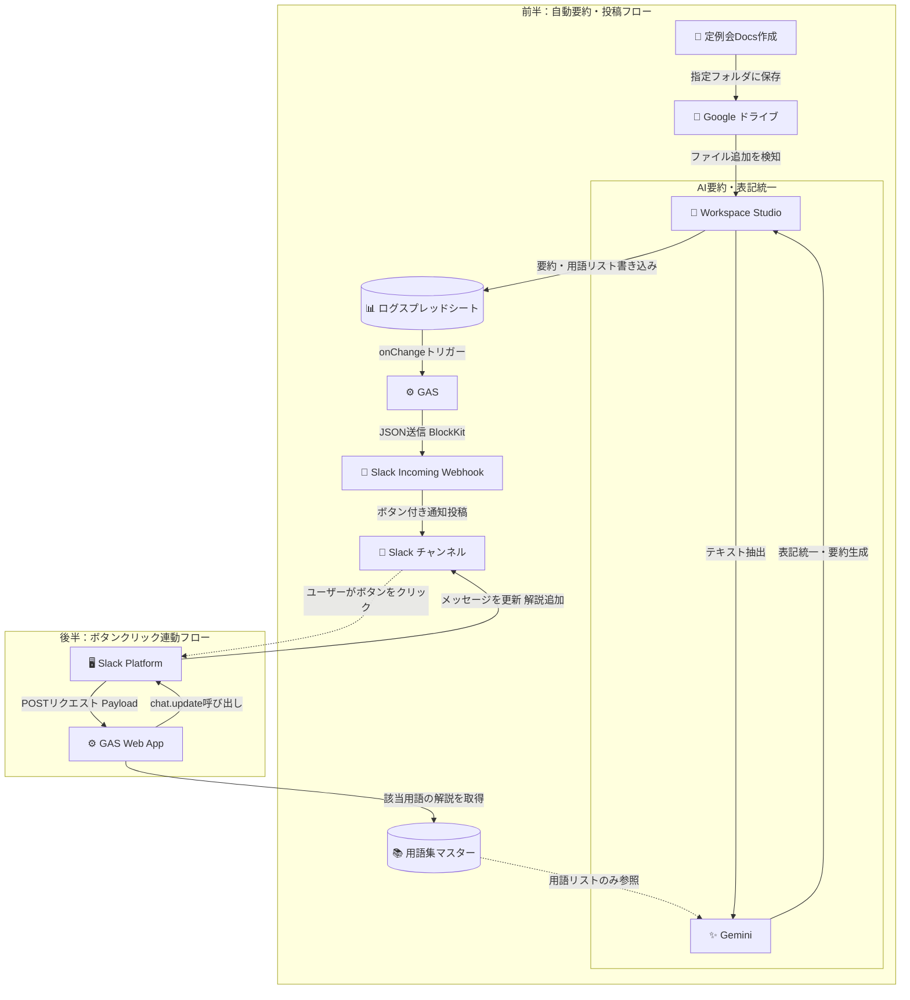

```mermaid
flowchart TD
    subgraph AutoPost [前半：自動要約・投稿フロー]
        A[📄 定例会Docs作成] -->|指定フォルダに保存| B[📁 Google ドライブ]
        B -->|ファイル追加を検知| C[🤖 Workspace Studio]
        
        M1[(📚 用語集マスター)] -.->|用語リストのみ参照| D
        
        subgraph AI_Standardize [AI要約・表記統一]
            C -->|テキスト抽出| D[✨ Gemini]
            D -->|表記統一・要約生成| C
        end

        C -->|要約・用語リスト書き込み| E[(📊 ログスプレッドシート)]
        E -->|onChangeトリガー| F[⚙️ GAS]
        F -->|JSON送信 BlockKit| G[🔗 Slack Incoming Webhook]
        G -->|ボタン付き通知投稿| H[💬 Slack チャンネル]
    end

    subgraph Interactive [後半：ボタンクリック連動フロー]
        H -.->|ユーザーがボタンをクリック| I[🖥️ Slack Platform]
        I -->|POSTリクエスト Payload| J[⚙️ GAS Web App]
        
        J -->|該当用語の解説を取得| M1
        J -->|chat.update呼び出し| I
        I -->|メッセージを更新 解説追加| H
    end
```
